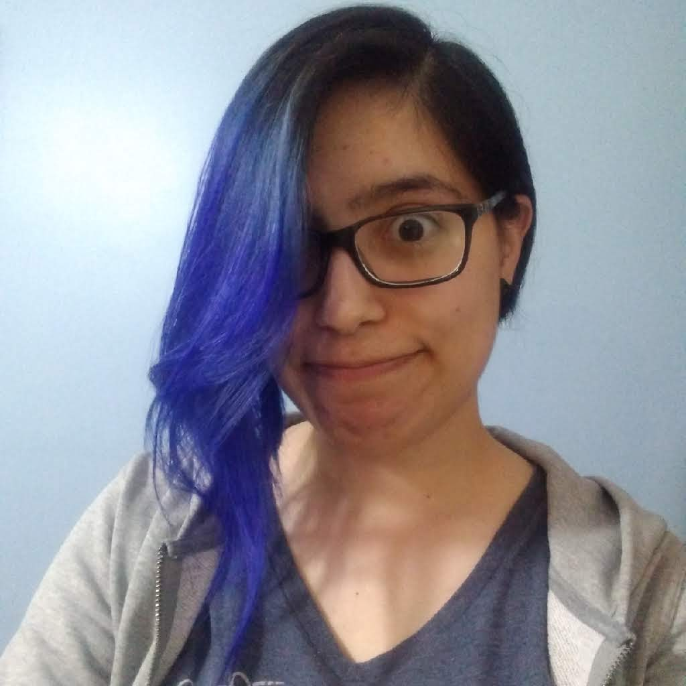

# Presentacion personal

## Quien soy

**María Luz Cucarella** 
Legajo: CYT-10829

### Un poco sobre mi

Me metí en el mundo de la programación casi que de casualidad. 
Siempre tuve un lado ~~obscuro~~ artístico que de vez en cuando sale a la luz. 
Disfruto mucho dibujando y creando, lo cual creo que también se nota cuando desarrollo.

Me gustan todos los animales pero los gatos y felinos en general siempre fueron mi punto débil.

Desde siempre me gustaron los videojuegos, el Guitar Hero 3 lo vicié hasta que la play no quizo saber más nada jajaja. 
Ahora juego más que nada a Duel Links y hace poco empecé con Apex.

No tengo una rama de la programación favorita, me encanta casi todo. 
Actualmente estoy aprendiendo backend con Django y tengo una buena base de frontend con Vue.js

